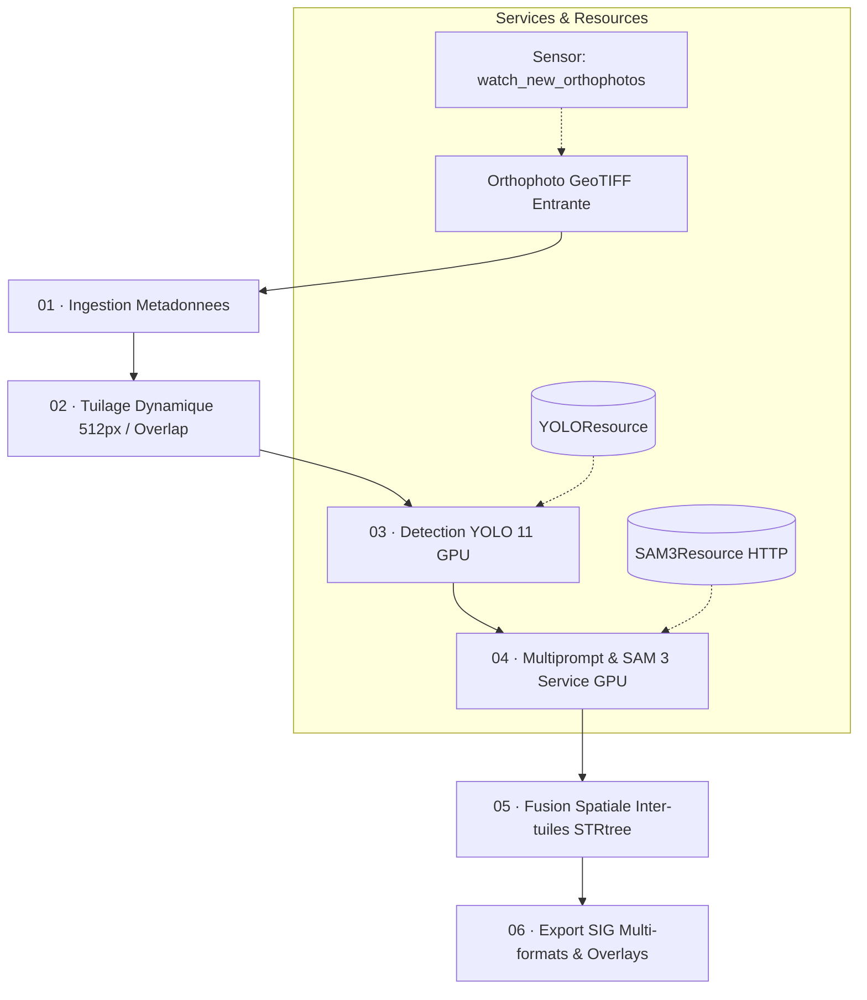

# Pipeline d'Extraction et de Régularisation d'Empreintes de Bâtiments
### **Orchestration Automatisée Dagster · Détection YOLO 11 · Segmentation SAM 3 · Livrables SIG**

---

## Table des Matières
1. [Vue d'Ensemble & Architecture](#-vue-densemble--architecture)
2. [Workflow du Pipeline (6 Assets Dagster)](#-workflow-du-pipeline-6-assets-dagster)
3. [Modèles d'Intelligence Artificielle](#-modèles-dintelligence-artificielle)
   - [YOLO 11 (Détection de Bâtiments)](#1-yolo-11-détection-damorce)
   - [SAM 3 Meta & Fine-tuné (Segmentation d'Instances)](#2-sam-3-meta--fine-tuné-segmentation-par-multiprompt)
   - [Stratégie Multiprompt (Boîte + Point)](#3-stratégie-multiprompt-boîte--point)
4. [Régularisation Géométrique & Topologique](#-régularisation-géométrique--topologique)
5. [Micro-Service SAM 3 (FastAPI)](#-micro-service-sam-3-fastapi)
6. [Arborescence du Projet](#-arborescence-du-projet)
7. [Prérequis Système & Matériels](#-prérequis-système--matériels)
8. [Installation & Déploiement](#-installation--déploiement)
   - [Option A : Déploiement Complet avec Docker Compose](#option-a--déploiement-complet-avec-docker-compose-recommandé)
   - [Option B : Lancement en Local / Environnements Dédiés](#option-b--lancement-en-local--environnements-dédiés)
9. [Configuration Détaillée (`config/pipeline.yaml`)](#-configuration-détaillée-configpipelineyaml)
10. [Livrables & Formats d'Exportation SIG](#-livrables--formats-dexportation-sig)
11. [Automatisation par Sensors (Surveillance d'Entrée)](#-automatisation-par-sensors-surveillance-dentrée)
12. [Tests & Validation](#-tests--validation)

---

## Vue d'Ensemble & Architecture

Ce projet implémente une solution logicielle industrielle et automatisée pour l'**extraction d'empreintes de bâtiments (building footprints)** à partir d'orthophotos très haute résolution (GeoTIFF, PNG, JPEG).

Il combine :
- **L'orchestration de données moderne** via **Dagster** (gestion des dépendances sous forme d'Assets, traçabilité, logging, relance partielle et sensors réactifs).
- **Une approche hybride bi-modèle State-of-the-Art** :
  - **YOLO 11 fine-tuné** pour localiser rapidement les zones d'intérêt et boîtes englobantes.
  - **SAM 3 (Segment Anything Model 3, Meta)** pour délimiter les contours exacts de chaque bâtiment par instance (multiprompt boîte + point).
- **Un moteur SIG vectoriel** assurant la reprojection géoréférencée (CRS d'origine), la fusion spatiale inter-tuiles (*seamless stitching*), la régularisation optionnelle et la génération de livrables SIG complets (GeoJSON, GeoPackage, Shapefile, Masques binaires et Overlays transparents haute fidélité).



---

## Workflow du Pipeline (6 Assets Dagster)

Le pipeline est structuré en **6 étapes séquentielles matérialisées sous forme d'Assets logiciels**, garantissant la modularité et l'isolation des responsabilités :

```
Orthophoto GeoTIFF
       │
       ▼
 01 · Ingestion     ─ Lecture des métadonnées (CRS, dimensions, transform affine) sans charger toute l'image en RAM.
       │
       ▼
 02 · Tuilage       ─ Découpage géométrique en grille de fenêtres régulières (ex. 512×512 px avec chevauchement de 64 px).
       │
       ▼
 03 · Détection     ─ Inférence YOLO 11 par tuile → Génération des boîtes englobantes [x1, y1, x2, y2] et masques natifs de repli.
       │
       ▼
 04 · Segmentation  ─ Calcul du point centroïde par boîte (Multiprompt) → Appel SAM 3 (FastAPI) → Vectorisation SIG locale.
       │
       ▼
 05 · Fusion        ─ Raccordement spatial inter-tuiles par index STRtree & Union-Find, suppression des doublons sur les coutures.
       │
       ▼
 06 · Export SIG    ─ Écriture des livrables (GeoJSON, GPKG, Shapefile, Masque binaire PNG, Overlay transparent, JSON de traçabilité).
```

### Détail des Étapes

1. **`orthophoto_meta` (`ingestion.py`)** :
   - Extrait les métadonnées géospatiales : emprise (`bounds`), résolution, nombre de canaux, CRS (`safe_crs`) et matrice de transformation affine (`transform`).
   - Ne charge **aucun pixel en mémoire vive**, permettant d'ingérer des fichiers raster de plusieurs gigaoctets.

2. **`fenetres_tuiles` (`tuilage.py`)** :
   - Calcule les fenêtres de tuilage (`rasterio.windows.Window`) couvrant l'intégralité du raster.
   - Gère le chevauchement paramétrable (`overlap`) pour éviter de perdre les bâtiments situés sur les bords des tuiles.

3. **`boites_yolo` (`detection.py`)** :
   - Lit chaque fenêtre à la demande (`read_window_rgb`).
   - Appelle `YOLOResource` (modèle chargé **une seule fois** en mémoire GPU pour tout le run).
   - Extrait les boîtes englobantes et conserve les masques natifs YOLO en mémoire pour un repli de secours.

4. **`polygones_par_tuile` (`segmentation.py`)** :
   - Pour chaque boîte YOLO, calcule un point intérieur représentatif via analyse morphologique (`points_for_boxes`).
   - Envoie la tuile RGB et les invites géométriques au micro-service SAM 3 (`per_box`).
   - Vectorise immédiatement la carte d'instances en coordonnées géographiques réelles via `instances_to_polygons`.

5. **`polygones_fusionnes` (`fusion.py`)** :
   - Assemble les polygones de toutes les tuiles.
   - Utilise un index spatial `shapely.strtree.STRtree` et une structure `Union-Find` pour fusionner les fragments d'un même bâtiment coupés par les bords de tuiles (`stitch_polygons`).
   - Renumérote les bâtiments de `1` à `N` sans discontinuité.

6. **`export_sig` (`export.py`)** :
   - Exporte la couche vectorielle finale dans les standards SIG.
   - Génère un masque binaire rasterisé et un rendu haute définition avec transparence et contours anticrénelés.
   - Produit un rapport JSON horodaté documentant la volumétrie, les latences et les paramètres de run.

---

## Modèles d'Intelligence Artificielle

### 1. YOLO 11 (Détection d'amorce)
- **Rôle** : Détecteur rapide de premier niveau pour repérer tous les bâtiments et produire des boîtes englobantes fiables.
- **Poids** : `checkpoints/yolo11/best.pt` (modèle fine-tuné sur orthophotos).
- **Caractéristiques** :
  - Seuil de confiance optimal : `conf = 0.20`.
  - Seuil NMS : `iou = 0.45`.
  - Taille d'inférence : alignée sur la taille des tuiles (`imgsz = 512`).

### 2. SAM 3 Meta & Fine-tuné (Segmentation par Multiprompt)
- **Rôle** : Délimitation fine des frontières de toits, suppression des ombres et séparation des instances collées.
- **Micro-service dédié** : Fonctionne via FastAPI sur le port `8077` en mode `bfloat16` ou `float32`.
- **Support hybride Base & Fine-tuné** :
  - **Modèle de Base** : Poids officiels Meta `facebook/sam3`.
  - **Modèle Fine-tuné (`building_ft_seg`)** : Fusionne les poids spécialisés issus de `sam3_logs/building_ft_seg/checkpoints/sam3.pt` sur le modèle interactif complet (`_merge_finetune_checkpoint`).

### 3. Stratégie Multiprompt (Boîte + Point)
Pour guider SAM 3 avec une précision maximale, chaque détection YOLO fait l'objet d'un pré-traitement morphologique dans [`multiprompt.py`](file:///c:/Users/HP/dagster_pipeline_crts/src/pipeline_batiments/core/multiprompt.py) :

```
Boîte YOLO [x1, y1, x2, y2]
             │
             ▼
   Découpage vignette (Crop)
             │
             ▼
       Gradient Canny
             │
             ▼
 Fermeture Morphologique (Kernel 3×3)
             │
             ▼
 Recherche de Contours & Centroïde
             │
             ▼
Point d'invite positif (cx, cy)
             │
             ▼
Prompt combiné (BBox + Point) ──► SAM 3 predict_inst
```

---

##  Régularisation Géométrique & Topologique

Le module [`src/pipeline_batiments/core`](file:///c:/Users/HP/dagster_pipeline_crts/src/pipeline_batiments/core) intègre plusieurs niveaux de traitement vectoriel post-segmentation :

| Module | Fonctionnalité | Usage / Objectif |
| :--- | :--- | :--- |
| **`rect_regularizer.py`** | Re-fit rectilinéaire & `minAreaRect` | Force les formes simples à 4 sommets orthogonaux à 90° et ajuste les formes complexes en L/T/U. |
| **`topology_regularizer.py`** | Alignement des murs mitoyens | Supprime les micro-espaces ou chevauchements anormaux entre bâtiments contigus. |
| **`shape_refiner.py`** | Simplification parcimonieuse | Réduit le nombre de sommets inutiles tout en préservant les angles dominants. |
| **`instances.py`** | Vectorisation directe | Extraction pure des contours par vectorisation `rasterio.features.shapes` (Recommandé par défaut pour préserver le F1/IoU maximal). |

> **Note de performance** : Par défaut, `regularization.enabled` est positionné sur `false` dans `config/pipeline.yaml` car la vectorisation directe offre les meilleures métriques sur le bâti urbain dense.

---

## Micro-Service SAM 3 (FastAPI)

Le micro-service SAM 3 isole l'inférence lourde du modèle de segmentation dans un processus dédié (GPU).

### Endpoints Principaux

#### `GET /health`
Vérifie la disponibilité et l'état du GPU.
```json
{
  "ready": true,
  "backend": "sam3_meta",
  "variant": "building_ft_seg",
  "ft_checkpoint": "/app/sam3_ckpt/sam3.pt",
  "device": "cuda",
  "gpu": "NVIDIA L40S",
  "vram_gb": 45.4,
  "torch": "2.11.0+cu128"
}
```

#### `POST /predict_instances`
Effectue la segmentation guidée d'une tuile image.
- **Payload entrant** :
  ```json
  {
    "image": "<base64_encoded_png>",
    "prompt": "building",
    "conf": 0.25,
    "sep": "per_box",
    "boxes_xyxy": [[50.0, 60.0, 200.0, 180.0]],
    "points_xy": [[125.0, 120.0]]
  }
  ```
- **Réponse** :
  - `shape`: dimensions `[H, W]`.
  - `label_b64`: carte d'instances encodée en buffer binaire `int32`.
  - `instances`: métadonnées par instance (score, boîte, id).
  - `latency_ms`: durée de calcul en millisecondes.

---

## Arborescence du Projet

```
dagster_pipeline_crts/
├── Dockerfile                          # Image conteneur pour Dagster (Webserver + Daemon)
├── docker-compose.yml                  # Déploiement multi-services orchestré (SAM3 + Dagster)
├── pyproject.toml                      # Spécification du projet & dépendances Python
├── dagster.yaml                        # Configuration du stockage et des runs Dagster
├── workspace.yaml                      # Définition de l'espace de travail Dagster
├── .env.example                        # Modèle de variables d'environnement
│
├── config/
│   └── pipeline.yaml                   # Paramètres métier (tuilage, seuils, modèles, exports)
│
├── checkpoints/
│   └── yolo11/
│       └── best.pt                     # Modèle YOLO 11 fine-tuné (~53 Mo)
│
├── sam3_logs/
│   └── building_ft_seg/
│       └── checkpoints/
│           └── sam3.pt                 # Poids SAM 3 fine-tunés (~10 Go)
│
├── third_party/
│   └── sam3/                           # Bibliothèque SAM 3 Meta
│
├── services/
│   └── sam3_service/                   # Micro-service HTTP FastAPI pour SAM 3
│       ├── Dockerfile                  # Image CUDA / Torch pour SAM 3
│       ├── server.py                   # Serveur FastAPI (endpoints /health, /predict_instances)
│       ├── config.py                   # Configuration & résolution automatique des poids
│       └── requirements-sam3.txt       # Dépendances du service SAM 3
│
├── src/
│   └── pipeline_batiments/             # Code source du pipeline Dagster
│       ├── definitions.py              # Point d'entrée Dagster (assemblage des assets & resources)
│       ├── jobs.py                     # Définition du job pipeline_complet_job
│       ├── sensors.py                  # Sensor de détection automatique des nouveaux fichiers
│       ├── assets/                     # 6 étapes du pipeline sous forme d'assets Dagster
│       │   ├── ingestion.py            # Étape 01 : Lecture raster & métadonnées
│       │   ├── tuilage.py              # Étape 02 : Découpage spatial en tuiles
│       │   ├── detection.py            # Étape 03 : Détection YOLO des boîtes
│       │   ├── segmentation.py         # Étape 04 : Segmentation SAM 3 & vectorisation
│       │   ├── fusion.py               # Étape 05 : Fusion des coutures inter-tuiles
│       │   └── export.py               # Étape 06 : Génération des livrables SIG & PNG
│       ├── core/                       # Moteur d'algorithmes et fonctions utilitaires
│       │   ├── geo_io.py               # Entrées/sorties géospatiales & conversion fenêtrée
│       │   ├── multiprompt.py          # Calcul des points centraux géométriques
│       │   ├── polygons.py             # Vectorisation et fusion spatiale STRtree
│       │   ├── instances.py            # Rendu visuel transparent, manipulation des masques
│       │   ├── building_regularizer.py # Régularisation d'angles droits
│       │   ├── rect_regularizer.py     # Re-fit géométrique rectilinéaire
│       │   └── topology_regularizer.py # Ajustement topologique des mitoyennetés
│       ├── resources/                  # Resources Dagster
│       │   ├── yolo_resource.py        # Gestion du cycle de vie du modèle YOLO
│       │   └── sam3_resource.py        # Client HTTP avec retries exponentiels vers SAM 3
│       └── yolo11/                     # Wrapper Ultralytics YOLO 11
│           ├── detect.py               # Logique de prédiction & NMS de masques
│           ├── config.py               # Configuration & chemins des checkpoints
│           └── env.py                  # Résolution du device (CUDA, CPU)
│
├── data/
│   ├── incoming/                       # Dossier d'entrée surveillé pour les nouvelles orthophotos
│   └── processed/                      # Données archivées après traitement
│
├── results/                            # Répertoire des résultats générés
└── tests/                              # Suite de tests unitaires automatisés
```

---

## Prérequis Système & Matériels

| Composant | Configuration Minimale | Configuration Recommandée |
| :--- | :--- | :--- |
| **GPU** | NVIDIA avec ≥ 12 Go VRAM (RTX 3060/4060) | **NVIDIA L40S / A100 / RTX 4090 (≥ 24 Go)** |
| **Précision GPU** | Float32 / Float16 | **BFloat16 natif** |
| **CUDA Driver** | ≥ 12.1 | **CUDA 12.8 / 13.0** |
| **RAM Système** | 16 Go | **32 Go à 64 Go** |
| **Stockage** | 30 Go d'espace disque disponible | **SSD NVMe (≥ 100 Go)** |
| **Système d'exploitation** | Linux (Ubuntu 22.04 / 24.04) ou Windows WSL2 | **Ubuntu 22.04 LTS** |
| **Docker Engine** | Version ≥ 24.0 | **Version ≥ 26.0** |
| **NVIDIA Container Toolkit** | Requis pour Docker GPU | **Requis** |

---

## Installation & Déploiement

### Option A : Déploiement Complet avec Docker Compose (Recommandé)

1. **Cloner le projet** :
   ```bash
   git clone <URL_DU_DEPOT>
   cd dagster_pipeline_crts
   ```

2. **Vérifier la présence des poids des modèles** :
   - Modèle YOLO 11 : `checkpoints/yolo11/best.pt`
   - Modèle SAM 3 : `sam3_logs/building_ft_seg/checkpoints/sam3.pt`

3. **Créer le fichier `.env`** :
   ```bash
   cp .env.example .env
   ```

4. **Construire et démarrer les conteneurs** :
   ```bash
   docker compose up --build -d
   ```

5. **Vérifier l'état des services** :
   ```bash
   docker compose ps
   # Vérification du service SAM 3 :
   curl http://localhost:8077/health
   ```

6. **Accéder à l'interface Dagster** :
   - Ouvrir votre navigateur sur [http://localhost:3001](http://localhost:3001).
   - Accéder à la vue **Assets** et lancer le job `pipeline_complet_job`.

---

### Option B : Lancement en Local / Environnements Dédiés

#### 1. Lancement du micro-service SAM 3 (Environnement GPU `sam3`)
```bash
# Activation de l'environnement Python/Conda dédié à SAM3
conda activate sam3

# Lancement du serveur FastAPI
export SAM3_DEVICE=cuda
export SAM3_DTYPE=bfloat16
export SAM3_PORT=8077
python -m services.sam3_service.server
```

#### 2. Lancement de Dagster (Environnement principal)
```bash
# Activation de l'environnement principal
conda activate pipeline_dagster

# Installation des dépendances
pip install -e .

# Démarrage de l'interface de développement Dagster
dagster dev -f src/pipeline_batiments/definitions.py
```
L'interface est accessible sur [http://localhost:3000](http://localhost:3000).

---

## Configuration Détaillée (`config/pipeline.yaml`)

Le fichier [`config/pipeline.yaml`](file:///c:/Users/HP/dagster_pipeline_crts/config/pipeline.yaml) centralise l'ensemble des hyperparamètres métier :

```yaml
# 1. Découpage en tuiles
tuilage:
  tile_size: 512             # Taille des tuiles en pixels (512x512)
  overlap: 64                # Chevauchement inter-tuiles (évite les coupures nettes)

# 2. Détection YOLO 11
yolo:
  conf_threshold: 0.20       # Seuil de confiance minimal pour retenir une boîte
  iou_threshold: 0.45        # Seuil IoU pour le NMS interne
  weights_path: checkpoints/yolo11/best.pt

# 3. Segmentation SAM 3
sam3:
  url: http://127.0.0.1:8077 # URL du micro-service SAM 3
  timeout_s: 300             # Timeout maximal par tuile
  max_retries: 3             # Tentatives en cas d'indisponibilité temporaire
  backoff_s: 5               # Délai initial entre les tentatives (backoff exponentiel)
  sep: per_box               # Stratégie de séparation ("per_box" | "grouped" | "argmax")

# 4. Régularisation géométrique vectorielle
regularization:
  enabled: false             # false = vectorisation directe (meilleur F1/IoU)
  method: rectfit            # rectfit | topology | none
  simplify_tolerance: 0.5    # Tolérance de simplification Douglas-Peucker (mètres)
  min_area_px: 50            # Surface minimale en pixels pour conserver un bâtiment

# 5. Fusion inter-tuiles
fusion:
  min_area_px: 50            # Surface minimale en pixels après fusion
  iou_merge_threshold: 0.5   # Seuil de recouvrement pour fusionner deux fragments de bâtiment

# 6. Formats et styles d'export
export:
  formats: [geojson, gpkg, shapefile, mask_png, overlay_png]
  output_dir: results
  overlay:
    alpha: 0.48              # Transparence du remplissage des bâtiments (0 à 1)
    fill_color: "#F97316"    # Couleur de remplissage hexadécimale (Orange)
    line_color: "#EF4444"    # Couleur des contours vectoriels (Rouge)
    line_thickness: 2        # Épaisseur des traits de délimitation (pixels)

# 7. Automatisation (Sensor)
sensor:
  watch_dir: data/incoming   # Répertoire surveillé pour l'ingestion automatique
  poll_interval_s: 30        # Intervalle d'analyse du dossier (secondes)

# 8. Image d'entrée par défaut pour les tests
input:
  path: data/incoming/03.tif
```

---

## Livrables & Formats d'Exportation SIG

Chaque exécution génère un sous-dossier horodaté unique dans `results/<nom_image>__<timestamp>/` contenant :

| Fichier | Format | Description |
| :--- | :--- | :--- |
| **`<stem>.geojson`** | GeoJSON (EPSG:4326) | Couche vectorielle standard avec attributs `building_id`, `area_m2`, `area_px`. |
| **`<stem>.gpkg`** | GeoPackage | Couche géospatiale multi-usages conservant le **CRS d'origine** de l'orthophoto (ex. Lambert-93, UTM). |
| **`<stem>_shp/`** | ESRI Shapefile | Dossier contenant les fichiers `.shp`, `.shx`, `.dbf`, `.prj` directement exploitables dans QGIS et ArcGIS. |
| **`<stem>_mask.png`** | Raster PNG 8-bit (L) | Masque binaire plein format (`255` = bâtiment, `0` = fond) à la résolution native de l'image. |
| **`<stem>_overlay.png`** | Image RGB 24-bit | Rendu haute fidélité superposant l'orthophoto, les masques transparents et des contours anticrénelés (`cv2.LINE_AA`). |
| **`<stem>__run.json`** | Métadonnées JSON | Traçabilité complète du run : nombre de bâtiments détectés, latence d'export, versions logicielles et paramètres. |

---

## Automatisation par Sensors (Surveillance d'Entrée)

Le pipeline inclut un capteur Dagster réactif ([`watch_new_orthophotos`](file:///c:/Users/HP/dagster_pipeline_crts/src/pipeline_batiments/sensors.py)) qui surveille en continu le dossier `data/incoming/`.

- Dès qu'un nouveau fichier (`.tif`, `.tiff`, `.png`, `.jpg`) est déposé dans `data/incoming/`, le sensor déclenche automatiquement un run dédié.
- L'état de traitement est mémorisé par curseur pour éviter les ré-exécutions inutiles.

---

## Tests & Validation

Une suite complète de tests automatisés avec `pytest` valide les composants critiques :

```bash
# Exécution de l'ensemble des tests unitaires
pytest tests/ -v
```

Les tests couvrent :
- La lecture et découpage fenêtré rasterio sans dépassement mémoire.
- La robustesse de la fusion géométrique `stitch_polygons` sur les cas limites (polygones vides, tuiles sans détection).
- Les régularisateurs de forme (`rectfit`, `topology`, `shape_refiner`).
- Le calcul du multiprompt et la résilience du client `SAM3Resource` en cas de déconnexion réseau.

